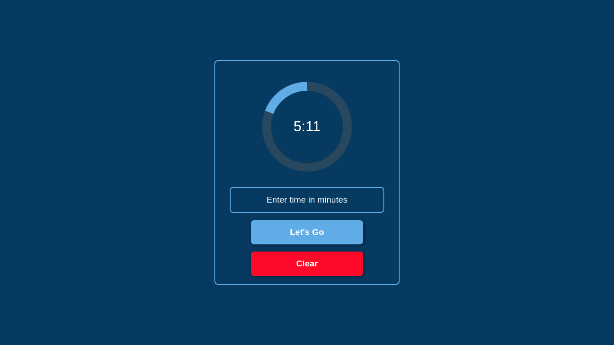
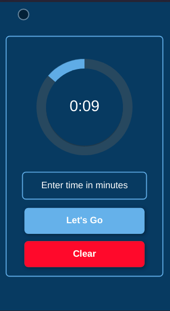

# Timer (Pomodoro)

<h1 align="center" title="timer">Timer ⏰</h1>

<h1 align="center"></h1>
<h1 align="center"></h1>

## ❔ About

Stopwatch created to time the time and when the time runs out, an alarm sound is played.

Can be used to perform the pomodoro method

## 📝 Requisites

It's necessary that you've installed the following programs

- [Git](https://github.com/)
- [NodeJS](http://nodejs.org)

## ✅ Installation

```bash
# Clone this repository
git clone https://github.com/DanteBenicio/timer-react

# Acess the project folder
cd timer-react

# Install the dependencies (Yarn)
yarn
## or (Npm)
npm install

# Run the project (Yarn)
yarn dev
## or (Npm)
npm run dev
```
## ✨ Tecnologies

- [React](https://reactjs.org/)
- [Typescript](https://typescriptjs.org)

## ⚡ Vite

Project created with [Vite](https://vitejs.dev/)